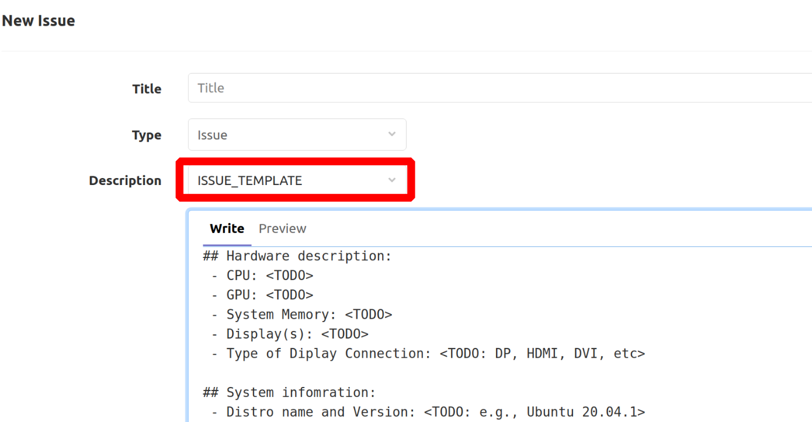

# About this repository

First of all, thanks a lot for your interest in helping the open-source AMD
drivers.

We currently use this repository to keep track of bugs reported by the
community, and only that for now. 

AMD GPU uses Freedesktop Gitlab Issue Tracking to track issues reported by the
community. If you've found a bug in amdgpu, this is the place to start. You'll
need to create a (free) [Gitlab account](https://gitlab.freedesktop.org/users/sign_up)
to submit an issue, and comment on issues. **If you have a patch, please send
it to amdgfx mailing list.**

# Create a bug report

If you've found a problem in amdgpu that is not a security risk, [search the
Issues on Gitlab](https://gitlab.freedesktop.org/drm/amd/-/issues), in case it
has already been reported. If you see something that matches the problem that
you are experiencing, make sure that you give a thumbs up (:thumbsup:) and
check if you can add more information based on your case. This is the best way
to draw attention to a bug and increase the chance to get it fixed.

If you cannot find any open Gitlab issues addressing the problem you found,
your next step will be to open a new issue. Your issue report should contain a
title and a clear description of the issue at the bare minimum. You should
include as much relevant information as possible and a code sample that
demonstrates the issue. Your goal should be to make it easy for yourself - and
others - to reproduce the bug and figure out a fix. For trying to help you with
this task, we recommend you report it using the ISSUE_TEMPLATE provided by
Gitlab. When you open a new issue, you will see a template option that looks
like the below picture:

Then, don't get your hopes up! Unless you have a "Code Red, Mission Critical,
the World is Coming to an End" kind of bug, do not expect that the issue report
will automatically see any activity or that someone will jump to fix it. You're
creating this issue report so that other people with the same problem can
confirm the bug and collaborate with you in fixing it.

# Create an Executable Test Case

Having a way to reproduce your issue will help people confirm, investigate, and
ultimately fix your issue. You can do this by providing an executable test
case. If you can write a shell script or maybe an [IGT](https://gitlab.freedesktop.org/drm/igt-gpu-tools) test, it would be
fantastic. Nevertheless, if you don't know how to do it, that's totally fine;
just try to do your best to describe how to reproduce the issue.

# Helping to Resolve Existing Issues

Beyond reporting issues, you can help the community resolve existing ones by
providing feedback about them. If you are new to amdgpu kernel development,
that might be a great way to walk your first steps, you'll get familiar with
the codebase and the processes.

If you check the issues list in
[Gitlab Issues](https://gitlab.freedesktop.org/drm/amd/-/issues), you'll find
lots of issues already requiring attention. What can you do about these? Quite
a bit, actually:

## Verifying Bug Reports

For starters, it helps just to verify bug reports. Can you reproduce the
reported issue on your computer? If so, you can add a comment to the issue
saying that you're seeing the same thing.

If an issue is very vague, can you help narrow it down to something more
specific? Maybe you can provide additional information to reproduce the bug, or
maybe you can eliminate unnecessary steps that aren't required to demonstrate
the problem.

Anything you can do to make bug reports more succinct or easier to reproduce
helps folks trying to write code to fix those bugs - whether you end up writing
the code yourself or not.

## Testing Patches

You can also help out by examining patches submitted by developers to fix any
bug.

# What about Feature Requests?

If you have any exciting feature that you want to see in the amdgpu driver, you
can create a "feature request" item into Gitlab Issues. However, keep in mind
that if there's a new feature that you want to see added to amdgpu, this will
be handled as a best effort. If this new feature is super important to you,
you'll need to write the code yourself - or convince someone else to partner
with you to write the code.

Sometimes, the line between 'bug' and 'feature' is a hard one to draw.
Generally, a feature is anything that adds new behavior, while a bug is
anything that causes incorrect behavior. Sometimes, the core team will have to
make a judgment call. That said, the distinction generally determines which
patch your change is released with; we love feature submissions!

If you'd like feedback on an idea for a feature before doing the work to make a
patch, please send an email to the
[amdgfx mailing list](https://lists.freedesktop.org/mailman/listinfo/amd-gfx).
You might get no response, which means that everyone is indifferent. You might
find someone who's also interested in building that feature. You might get a
"This won't be accepted". But it's the proper place to discuss new ideas.
Gitlab Issues are not a particularly good venue for the sometimes long and
involved discussions new features require.
